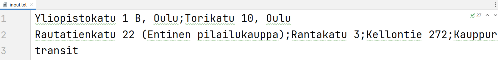
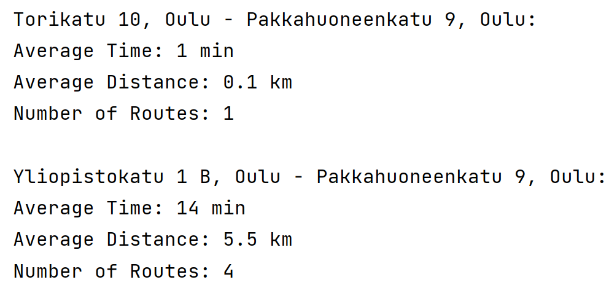
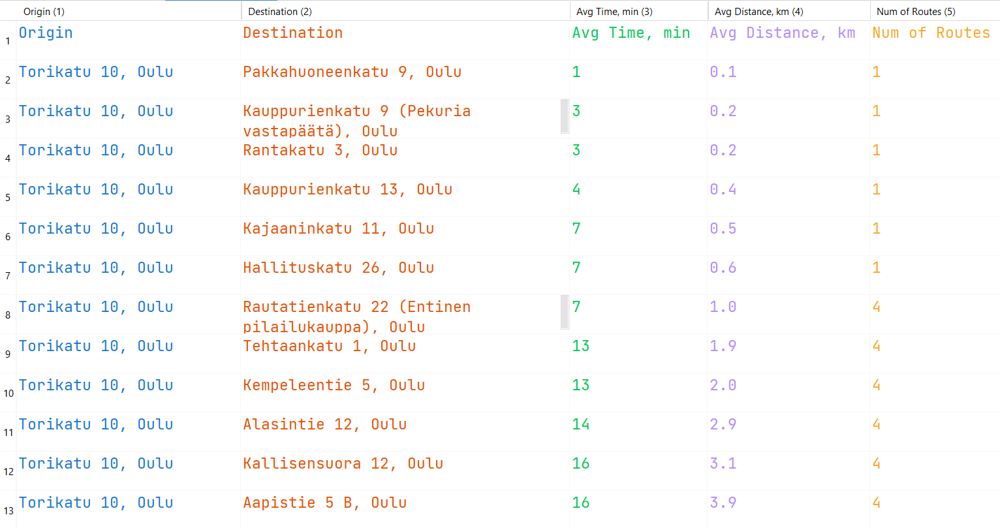
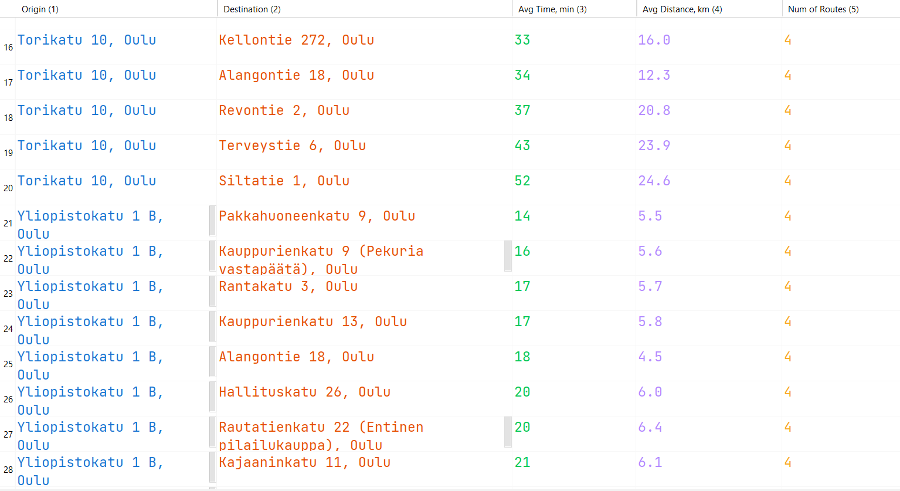

# Destination Option Picker
## Context
I recently moved to a new country. I need to visit a photo-studio from a list before applying for the ID card, but there were 19 addresses. Since I am new in town, I have no idea which is the closest to me. So instead of typing every address in Google Maps, I decided to write this script. I inputted my home address and an address of a place I visit often near the city center. Ran the script. And... now I know which photo-studio is the closest
## What it does
Input:
- Origin addresses
- Potential destination addresses
- Mode of transportation
 

After that using Google Maps API it analyzes every potential route between every origin and destination point. Script sorts that information, stores it into a csv file, prints the most optimal route for every origin point.

Input

Output

CSV file

## How to use it
Basically, you can input a several origin and potential destinations addresses and get the most optimal route for each starting point.
## Technology Stack
- __CSV__ module for storing information
- __Google Maps API__ for getting routes info
